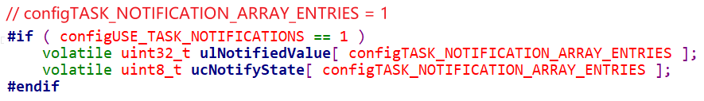

## 任务通知的使用


### 1. 任务通知的理论讲解

#### 1.1 任务通知的核心

本节源码：`22_freertos_example_tasknotify_semaphore`，来自`15_freertos_example_semaphore`，下一节视频才修改。

理解任务通知的核心在于TCB结构体中有这两项：



ucNotifyState有3种取值：

* taskNOT_WAITING_NOTIFICATION：任务没有在等待通知
* taskWAITING_NOTIFICATION：任务在等待通知
* taskNOTIFICATION_RECEIVED：任务接收到了通知，也被称为pending(有数据了，待处理)  


使用流程：使用ucNotifyState来切换任务状态(阻塞、就绪)，使用ulNotifiedValue来传递信息。

* 任务A被创建出来时，ucNotifyState为`taskNOT_WAITING_NOTIFICATION`
* 它想等待通知的话
  * 调用`ulTaskNotifyTake `或`xTaskNotifyWait  `，进入`taskWAITING_NOTIFICATION`
  * 表示在等待通知，任务进入阻塞状态
* 任务B可以调用这两个函数来通知A：`xTaskNotifyGive  `或`xTaskNotify  `
  * 任务A的ucNotifyState就变为`taskNOTIFICATION_RECEIVED`
  * 表示收到了通知，待处理
* 任务A从阻塞状态变为就绪态，它运行时
  * 从`ulTaskNotifyTake `或`xTaskNotifyWait  `得到数值并返回
  * 返回之前把ucNotifyState恢复为`taskNOT_WAITING_NOTIFICATION`


#### 1.2 怎么传递信息

函数原型如下：

```c
BaseType_t xTaskNotifyGive( TaskHandle_t xTaskToNotify );
uint32_t ulTaskNotifyTake( BaseType_t xClearCountOnExit, TickType_t xTicksToWait );

BaseType_t xTaskNotify( TaskHandle_t xTaskToNotify, uint32_t ulValue, eNotifyAction eAction );
BaseType_t xTaskNotifyWait( uint32_t ulBitsToClearOnEntry, 
                            uint32_t ulBitsToClearOnExit, 
                            uint32_t *pulNotificationValue, 
                            TickType_t xTicksToWait );
```


| 发送函数        | 作用                    | 接收函数         | 作用             |
| --------------- | ----------------------- | ---------------- | ---------------- |
| xTaskNotifyGive | val++                   | ulTaskNotifyTake | val-- 或 val = 0 |
| xTaskNotify     |  | xTaskNotifyWait |                  |
|  | 不使用val，只起通知作用 |  | 可以在函数进入时清除val的某些位<br />可以在函数退出前清除val的某些位<br />可以取得val的值 |
|                 | val \|= (bits)          |                  |                  |
|                 | val++ |                  |                  |
|                  | val = xxx <br />不覆盖，<br />当ucNotifyState表示在等待才起效 |||
|                  | val = xxx<br />覆盖 |||


eNotifyAction参数说明：

| eNotifyAction取值         | 说明                                                         |
| ------------------------- | ------------------------------------------------------------ |
| eNoAction                 | 仅仅是更新通知状态为"pending"，未使用ulValue。<br />这个选项相当于轻量级的、更高效的二进制信号量。 |
| eSetBits                  | 通知值 = 原来的通知值 \| ulValue，按位或。<br />相当于轻量级的、更高效的事件组。 |
| eIncrement                | 通知值 = 原来的通知值 + 1，未使用ulValue。<br />相当于轻量级的、更高效的二进制信号量、计数型信号量。<br />相当于`xTaskNotifyGive()`函数。 |
| eSetValueWithoutOverwrite | 不覆盖。<br />如果通知状态为"pending"(表示有数据未读)，<br />则此次调用xTaskNotify不做任何事，返回pdFAIL。<br />如果通知状态不是"pending"(表示没有新数据)，<br />则：通知值 = ulValue。 |
| eSetValueWithOverwrite    | 覆盖。<br />无论如何，不管通知状态是否为"pendng"，<br />通知值 = ulValue。 |


### 2.  任务通知使用_轻量级信号量

本节源码：`22_freertos_example_tasknotify_semaphore`，来自`15_freertos_example_semaphore`。

函数对比：

|      | 信号量                                                       | 使用任务通知实现信号量                                       |
| ---- | ------------------------------------------------------------ | ------------------------------------------------------------ |
| 创建 | SemaphoreHandle_t xSemaphoreCreateCounting( <br />                UBaseType_t uxMaxCount, <br />                UBaseType_t uxInitialCount ); | 无                                                           |
| Give | xSemaphoreGive( SemaphoreHandle_t xSemaphore );              | BaseType_t xTaskNotifyGive( TaskHandle_t xTaskToNotify );    |
| Take | xSemaphoreTake(<br/>                   SemaphoreHandle_t xSemaphore,<br/>                   TickType_t xBlockTime<br/>               ); | uint32_t ulTaskNotifyTake( <br />                                   BaseType_t xClearCountOnExit, <br />                                   TickType_t xTicksToWait <br />                                  ); |


### 3. 任务通知使用_轻量级队列

本节源码：`23_freertos_example_tasknotify_queue`，来自`13_freertos_example_queue`。

函数对比：
|      | 队列                                                         | 使用任务通知实现队列                                         |
| ---- | ------------------------------------------------------------ | ------------------------------------------------------------ |
| 创建 | QueueHandle_t xQueueCreate(<br/>                           UBaseType_t uxQueueLength,<br/>                           UBaseType_t uxItemSize<br/>                       ); | 无                                                           |
| 发送 | BaseType_t xQueueSend(<br/>                           QueueHandle_t xQueue,<br/>                           const void * pvItemToQueue,<br/>                           TickType_t xTicksToWait<br/>                      ); | BaseType_t xTaskNotify( <br/>                     TaskHandle_t xTaskToNotify, <br/>					 uint32_t ulValue, <br/>					 eNotifyAction eAction <br />               ); |
| 接收 | BaseType_t xQueueReceive( QueueHandle_t xQueue,<br/>                          void * const pvBuffer,<br/>                          TickType_t xTicksToWait <br />                    ); | BaseType_t xTaskNotifyWait( <br/>                      uint32_t ulBitsToClearOnEntry, <br/>					  uint32_t ulBitsToClearOnExit, <br/>					  uint32_t *pulNotificationValue, <br/>					  TickType_t xTicksToWait<br />                  ); |


### 4. 任务通知使用_轻量级事件组

本节源码：`24_freertos_example_tasknotify_event_group`，来自`20_freertos_example_event_group`。

假设有3个任务：

* 任务1做事件1
* 任务2做事件2
* 任务3等待事件1、事件2都发生

可以使用事件组来编写程序，也可以使用任务通知来编写程序。

函数对比：

|          | 事件组                                                       | 使用任务通知实现事件组                                       |
| -------- | ------------------------------------------------------------ | ------------------------------------------------------------ |
| 创建     | EventGroupHandle_t xEventGroupCreate( void )                 | 无                                                           |
| 设置事件 | EventBits_t xEventGroupSetBits( <br />                 EventGroupHandle_t xEventGroup,<br />                 const EventBits_t uxBitsToSet <br />                 ); | BaseType_t xTaskNotify( <br/>                     TaskHandle_t xTaskToNotify, <br/>					 uint32_t ulValue, <br/>					 eNotifyAction eAction <br />               ); |
| 等待事件 | EventBits_t xEventGroupWaitBits( <br/>                EventGroupHandle_t xEventGroup,<br/>                const EventBits_t uxBitsToWaitFor,<br/>                const BaseType_t xClearOnExit,<br/>                const BaseType_t xWaitForAllBits,<br/>                TickType_t xTicksToWait <br/>				); | BaseType_t xTaskNotifyWait( <br/>                      uint32_t ulBitsToClearOnEntry, <br/>					  uint32_t ulBitsToClearOnExit, <br/>					  uint32_t *pulNotificationValue, <br/>					  TickType_t xTicksToWait<br />                  ); |


