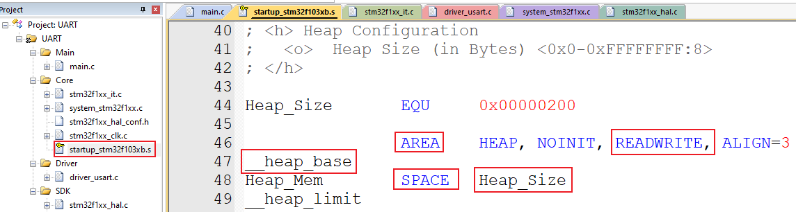
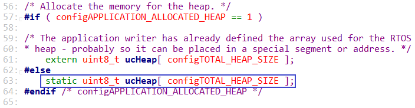
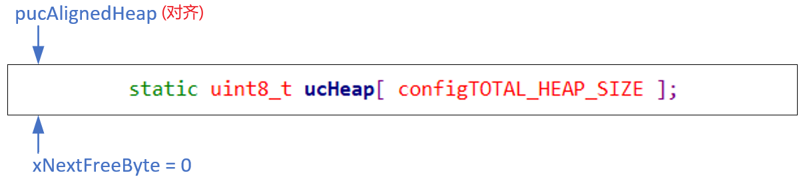
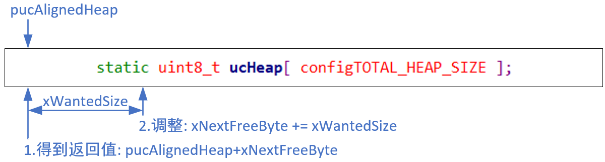
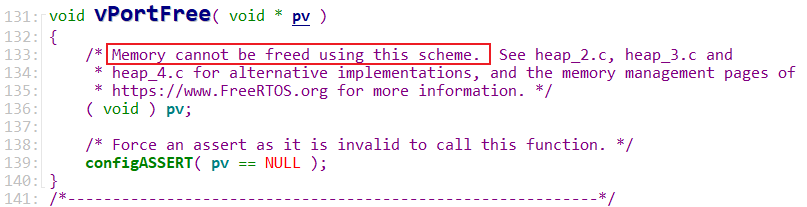

## heap_1源码分析

* 代码
  

### 1. 内存管理概述

文件在`FreeRTOS/Source/portable/MemMang`下，它也是放在`portable`目录下，表示你可以提供自己的函数。

源码中默认提供了5个文件，对应内存管理的5种方法。

后续章节会详细讲解。

| 文件     | 优点                           | 缺点                     |
| -------- | ------------------------------ | ------------------------ |
| heap_1.c | 分配简单，时间确定             | 只分配、不回收           |
| heap_2.c | 动态分配、最佳匹配             | 碎片、时间不定           |
| heap_3.c | 调用标准库函数                 | 速度慢、时间不定         |
| heap_4.c | 相邻空闲内存可合并             | 可解决碎片问题、时间不定 |
| heap_5.c | 在heap_4基础上支持分隔的内存块 | 可解决碎片问题、时间不定 |

### 2. 堆的概念

很多人把"堆栈"相提并论，其实"堆"、"栈"是完全没有联系。"栈"的作用我们前面已经讲了很多，"堆"是什么？

"堆"就是一块或者多块内存，我们可以从中申请一小块内存来使用，使用完毕后可以释放这一小块内存。

简单地说，一开始，"堆"是一些空闲内存，我们可以：

* 使用malloc函数从中申请、获得一小块内存
* 使用free函数释放这一小块内存
* 这些malloc、free函数就是用来管理这些内存的
* malloc、free函数可以有其他名称，比如FreeRTOS里是pvPortMalloc、vPortFree

### 3. 堆的内存来源

一开始，"堆"是一些空闲内存，怎么得到这些空闲内存？

* 在汇编代码里指定一个AREA：在汇编代码里，使用SPACE命令可以分配一段空间
  

* 在C代码里，定义一个全局数组：
  

### 4. heap_1代码分析

heap_1.c里，只实现了pvPortMalloc函数，vPortFree函数并未实现。

#### 4.1 初始状态

#### 4.2 分配内存

`void * pvPortMalloc( size_t xWantedSize )`的内部实现：

#### 4.3 释放内存

使用heap_1的时候，无法释放内存。

