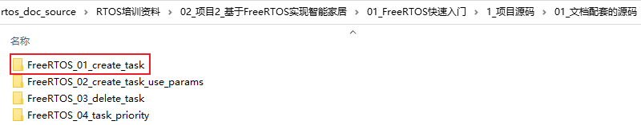
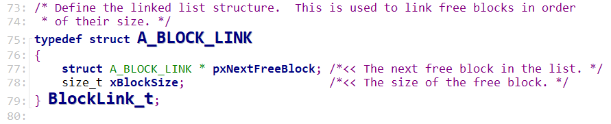
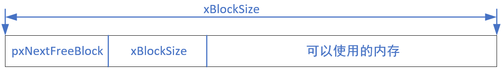
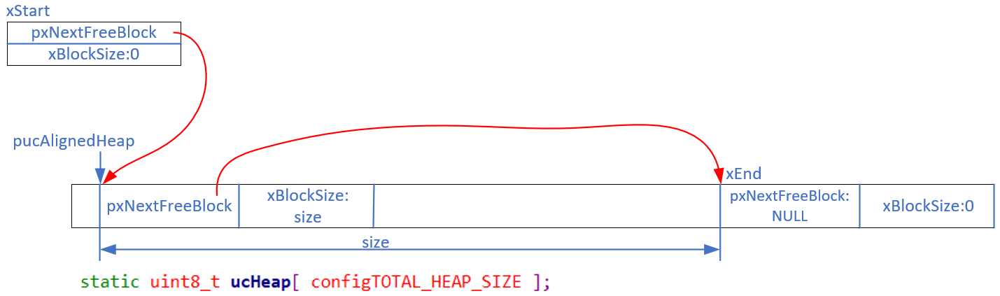
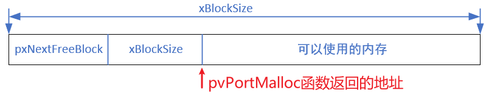
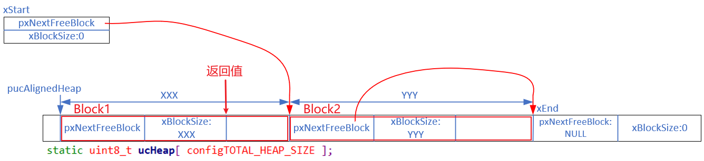
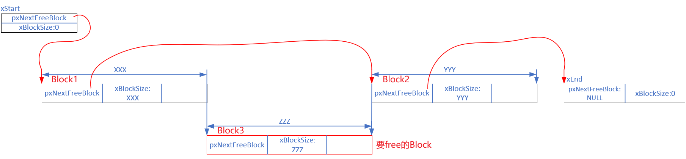
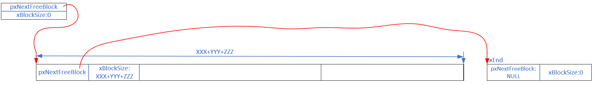

## heap_4源码分析

* 代码
  

### 1. 内存管理概述

文件在`FreeRTOS/Source/portable/MemMang`下，它也是放在`portable`目录下，表示你可以提供自己的函数。

源码中默认提供了5个文件，对应内存管理的5种方法。

后续章节会详细讲解。

| 文件     | 优点                           | 缺点                     |
| -------- | ------------------------------ | ------------------------ |
| heap_1.c | 分配简单，时间确定             | 只分配、不回收           |
| heap_2.c | 动态分配、最佳匹配             | 碎片、时间不定           |
| heap_3.c | 调用标准库函数                 | 速度慢、时间不定         |
| heap_4.c | 相邻空闲内存可合并             | 可解决碎片问题、时间不定 |
| heap_5.c | 在heap_4基础上支持分隔的内存块 | 可解决碎片问题、时间不定 |

### 2. heap_4代码分析

heap_4.c里，使用链表来管理内存。链表结构体为：

这个结构体用来表示空闲块：

* pxNextFreeBlock：指向下一个空闲块
* xBlockSize：当前空闲块的内存大小

这个结构体后面，紧跟着空闲内存，如下图所示：

#### 2.1 初始状态

* 链表头：xStart，它是一个BlockLink_t结构体，是链表中第1个元素
* 第1个FreeBlock：从pucAlignedHeap开始，它的xBlockSize等于Block的大小，表示整个堆的大小(除去尾部)
* 链表尾：xEnd，它是BlockLink_t指针，指向空闲内存的尾部

#### 2.2 分配内存

`void * pvPortMalloc( size_t xWantedSize )`的内部实现：

* 调整xWantedSize：加上sizeof(struct BlockLink_t)，向上对齐
* 从xStart开始寻找第1个大小合适FreeBlock：这个FreeBlock的xBlockSize >= xWantedSize
* 把这个FreeBlock从链表中删除
* 如果这个FreeBlock的xBlockSize 比较大，把它拆分成2个Block
  * 第1个Block本占用，大小为xWantedSize
  * 第2个Block是空闲的，还要放入链表：按照xBlockSize从小到大的顺序插入链表
* 返回的地址如下图所示：
  

分配结果如下图所示：

#### 2.3 释放内存

`void vPortFree( void * pv )`函数：

* 根据pv往前移动，得到BlockLink_t结构体
* 把这个结构体放入xStart链表：按照Block地址从小到大的顺序插入链表
* 并且：尝试合并相邻的Block

##### 2.3.1 跟heap_2的对比

* 相同点：都是使用BlockLink_t结构体管理堆，都有一个空闲Block链表
* 差别：
  * heap_2：空闲链表中，按照Block的大小进行排序；不会合并相邻的Block；xEnd是一个结构体
  * heap_4：空闲链表中，按照Block的地址进行排序；会合并相邻的Block；xEnd是一个指针

##### 2.3.2 示例

下图中，Block1、Block2是空闲块，要释放的Block3跟Block1、Block2首尾相连：

释放Block3的过程如下：

* 先按照地址，在空闲链表中找到要插入的位置：Block1
* 发现Block3、Block1地址相连，于是：合并Block1、Block3，假设合并后得到新的Block1
* 发现新的Block1跟Block2地址相连，于是：合并新Block1、Block2
* 结果如下
  

