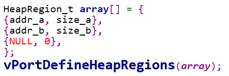
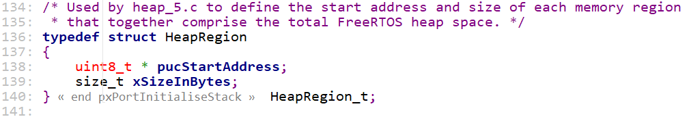
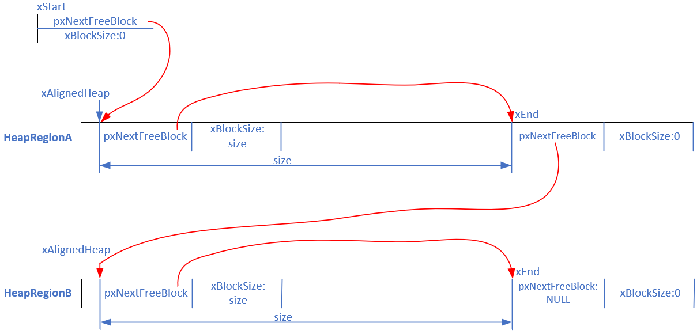

## heap_5源码分析

* 代码
  

### 1. 内存管理概述

文件在`FreeRTOS/Source/portable/MemMang`下，它也是放在`portable`目录下，表示你可以提供自己的函数。

源码中默认提供了5个文件，对应内存管理的5种方法。

后续章节会详细讲解。

| 文件     | 优点                           | 缺点                     |
| -------- | ------------------------------ | ------------------------ |
| heap_1.c | 分配简单，时间确定             | 只分配、不回收           |
| heap_2.c | 动态分配、最佳匹配             | 碎片、时间不定           |
| heap_3.c | 调用标准库函数                 | 速度慢、时间不定         |
| heap_4.c | 相邻空闲内存可合并             | 可解决碎片问题、时间不定 |
| heap_5.c | 在heap_4基础上支持分隔的内存块 | 可解决碎片问题、时间不定 |


### 2. heap_5和heap_4的区别

heap_5支持分隔的内存块，heap_4只支持单一的内存块。

heap_5和heap_4的代码几乎一样，只是在初始化函数方面有差别：

* heap_4：在第1次调用`pvPortMalloc`时，使用`prvHeapInit`进行初始化
* heap_5：在使用`pvPortMalloc`之前，需要先调用`vPortDefineHeapRegions`指定内存区域


heap_5和heap_4，它们的`pvPortMalloc`、`vPortFree`，函数代码时完全一样的。


### 3. heap_5的初始化

用法：



#### 3.1 怎么表示多个内存块

表示一个内存块时，使用如下结构体：




表示多个内存块时，使用HeapRegion_t数组。


#### 3.2 初始化函数

初始化函数的原型如下：

```c
void vPortDefineHeapRegions( const HeapRegion_t * const pxHeapRegions );
```

在`pxHeapRegions`数组中，可以指定多个HeapRegion，数组中最后一项的xSizeInBytes等于0。

执行完这个函数后，链表示意图如下：




