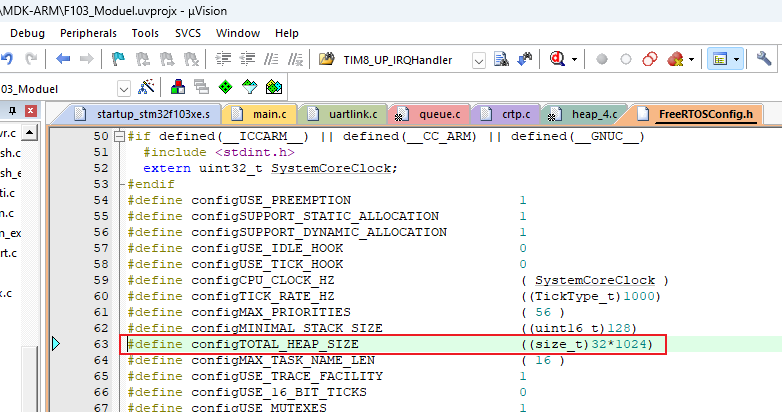

# CRTP协议移植

## 1. 协议分析

参考资料：

crazyflie-CRTP解析：https://www.ngui.cc/51cto/show-724815.html?action=onClick

```shell
为了和Crazyflie通信，Crazyflie飞控中提出一种高层次的协议叫做CRTP(Crazy RealTime Protocol)。这种简单的协议使用一些可以收发数据的双向目标端口，但是大都时候通信由主机发起。
```


官方文档：https://www.bitcraze.io/documentation/repository/crazyflie-firmware/master/functional-areas/crtp/


### 1.1 协议层次

```shell
+-------------------+
+     Subsystems    +   <- Log/Param/Commander/...
+-------------------+
+       CRTP        +   <- (port, channel, payload)
+-------------------+
+       Link        +   <- Radio link or USB link
+-------------------+   
+  Physical medium  +   <- radio or USB
+-------------------+
```


### 1.2 数据包格式


一个数据包大小是32字节：

* size：表示后面data数组里有效数据的长度，占据1字节
* header：里面含有channel、port，占据1字节
* data：30字节的buffer，用来存放数据

### 1.3 怎么传递数据包

构造一个链路层结构体：


示例：


### 1.4 示例: 使用UART传输数据包

先发送0x55, 再发生数据包本身

源码：


### 1.5 添加CRTP基本功能

#### 1.5.1 初始化

* 链路层初始化

  ```shell
  uartlinkInit();
   crtpSetLink(uartlinkGetLink());
  ```

  

* 创建底层任务：crtpInit

  

  


* 创建crtpSrv：就可以实现ping功能
  


#### 1.5.2 移植代码

源码：


#### 1.5.3 上机测试

使用串口工具给开发发送PING包：

* size：7
* header：0xF0
  * port：CRTP_PORT_LINK，0x0F
  * channel：linkEcho，0x00
* data：100ask，7个字符(0x31 0x30 0x30 0x61 0x73 0x6B 0x00)

```shell
55 07 F0 31 30 30 61 73 6B 00
```


第1个问题：堆不够用导致队列创建失败。

解决：




## 2. 新的数据包

源码：


### 2.1 定义新的port/channel

PORT:  CRTP_PORT_LED     		 = 0x0E,

Channel：

```shell
typedef enum {
  ledSet   = 0x00,
  ledGet   = 0x01,
} LinkNbr;
```

数据格式：

```shell
控制LED状态: data[0]表示哪个LED、data[1]表示什么状态(1-亮, 0-灭)
读取LED状态: 
发来数据包：data[0]表示哪个LED
返回数据包：data[0]表示哪个LED、data[1]表示状态(1-亮, 0-灭)
```


### 2.2 增加处理函数


### 2.3 上机测试

控制LED：发包

```shell
点亮 55 02 e0 00 01
熄灭 55 02 e0 00 00
```

读取LED状态: 发包

```shell
55 01 e1 00
```


