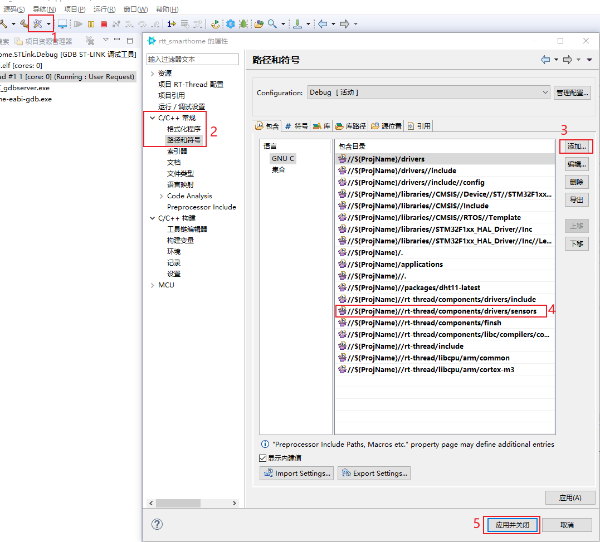

# 使用RT-Thread_Studio十分钟实现智能家居

资料下载：

```shell
https://e.coding.net/weidongshan/livestream/doc_and_source_for_livestream.git
```


## 1. 创建工程

本节课程源码为：


启动RT-Thread Studio后，可以看到如下界面：


选择你的目录，点击"启动"。

在如下界面点击""


然后配置工程：选择芯片、调试串口、调试器等：


## 2. 编译体验

在工程界面，选中工程后，如下图操作：


然后点击如下图标烧写程序：


在串口工具里就可以看到启动记录：


## 3. 使用DHT11

本节课程源码为：


做实验之前，先如下图接上DHT11模块：


### 3.1 添加DHT11

如下图添加软件包：


然后搜索DHT11并添加：


添加后，使用快捷键"Ctrl + S"保存配置，它会自动进行配置。

### 3.2 解决编译错误

使用快捷键"Ctrl + B"编译程序，会出现如下错误：

* drv_gpio.h无法找到
* sensor.h无法找到
* rt_hw_sensor_register函数未定义


对于drv_gpio.h，在`dht11_sample.c`中改为：

```c
#include "drv_common.h"
```


对于sensor.h，添加头文件目录：

//${ProjName}//rt-thread/components/drivers/include/drivers

如下图操作：




对于rt_hw_sensor_register函数未定义，配置组件：


修改使用的引脚：


最后重新编译、运行程序，在串口上可以看到：


### 3.3 改进程序

重启板子时，经常看见如下错误：


原因是刚复位、上电时，DHT11尚未准备就绪，如下添加延时即可：


## 4. 使用AT设备ESP8266

本节课程源码：


做实验之前，先接上ESP8288:


### 4.1 添加AT设备

如下图操作：


使用快捷键"Ctrl + S"保存后编译，有如下错误：


在百度搜索错误信息"rt-thread undefined reference to `_sbrk'“，得到解决方法：


再次使用快捷键"Ctrl + S"保存后编译，烧写、测试，有如下错误：


在源码里搜"uart1"，仿照uart1添加uart3，在`drivers\board.h`添加如下代码：

```c
#define BSP_USING_UART1
#define BSP_UART1_TX_PIN       "PA9"
#define BSP_UART1_RX_PIN       "PA10"

/* 100ask添加的 */
#define BSP_USING_UART2
#define BSP_UART2_TX_PIN       "PA2"
#define BSP_UART2_RX_PIN       "PA3"
```

### 4.2 添加AT客户端

开发板是AT Client，ESP8266是AT Server:


在开发板上运行的程序要添加AT Client（默认已经添加），如下操作：


### 4.3 测试

重新编译 、烧写，可以成功识别出AT设备，然后可以执行ifconfig命令查看IP、使用ping命令测试网络：


## 5. ESP8266驱动分析

### 5.1 层次

* 上层APP或其他协议，只看到netdev，它不在意这个网卡是使用AT命令实现的，还是通过其他方式实现的
* 对于ESP8266，它是使用AT命令实现的，它对应的netdev的操作函数里，要使用AT命令
  * netdev的函数要使用AT命令，就是使用下面的at_device提供的函数
  * at_device
* 我们可能使用多个ESP8266，它们的通用代码放在at_deivce_class里
* 每个ESP8266通过一个串口跟板子连接，这个串口分为2层
  * 上层：at_client，实现AT命令相关操作
  * 下层：纯粹的UART驱动（对应rt_device_t），只是实现UART收发


## 6. 使用MQTT

本节源码：


### 6.1 添加MQTT

如下图操作，添加MQTT：


然后进行配置：


最后修改源码`packages\pahomqtt-v1.1.0\samples\mqtt_sample.c`，代码如下：

```c
#define MQTT_URI                "tcp://iot.100ask.net:1883"
#define MQTT_USERNAME           "admin"
#define MQTT_PASSWORD           "public"
#define MQTT_SUBTOPIC           "/topic/ctrl"
#define MQTT_PUBTOPIC           "/topic/humiture"
#define MQTT_WILLMSG            "Goodbye!"
```

### 6.2 编译测试

1. 启动微信小程序"百问网嵌入式物联网"

   进去后，如下图点击：

   

2. 在串口操作

```shell
// 连接服务器
mqtt_start

// 发布消息
mqtt_publish /topic/humiture {\"Temperature\":1,\"Humidity\":9}
```

同时，可以在微信小程序点击电灯、风扇等图标，观察串口信息。


注意：如果小程序不好用，如下操作重新进入：


