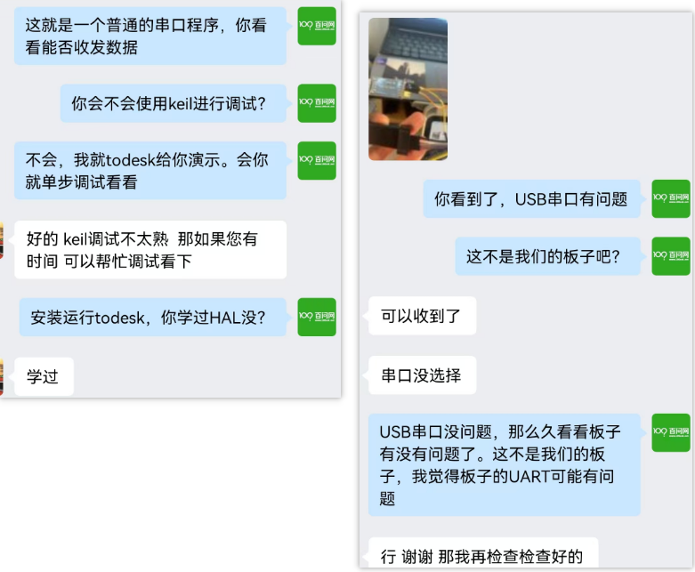
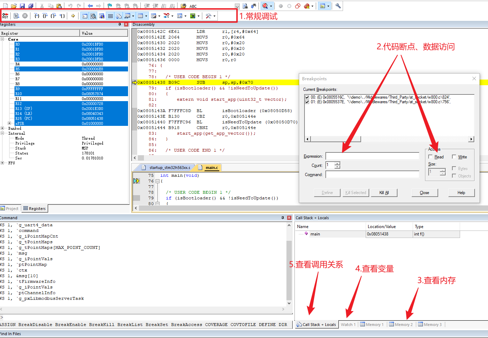

# 周日直播_竟然好多人不会使用Keil来调试

## 1. 瑞士军刀的逻辑分析仪

百问网的STM32F103瑞士军刀，有一个逻辑分析仪的项目。

最近有好几个学生咨询：怎么扫描串口没有识别出逻辑分析仪？

我们一看：这不是我们的板子啊，不忍心拒绝他，问他会不会调试？

他非常茫然。

我也很茫然啊。

我们点灯时不是已经用到调试了吗？怎么做项目了还不会调试？

## 2. 本周日：教大家怎么使用Keil来调试

12月8号，周日，下午3点到5点，直播：

* B站：搜韦东山
* 视频号：搜百问网
* 抖音：搜韦东山

包括但不限于下图的内容：

## 3. 更专业的调试技术

周日的直播，只是一些简单的调试。

要具备专家级别的调试，不是1、2个直播能讲完的，需要一整天的学习。

12月份有2个调试专题课程：

* 12月15日，调试专题深圳线下班
* 12月29日，调试专题线上班

感兴趣的同学可以看看：

