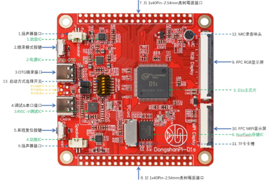
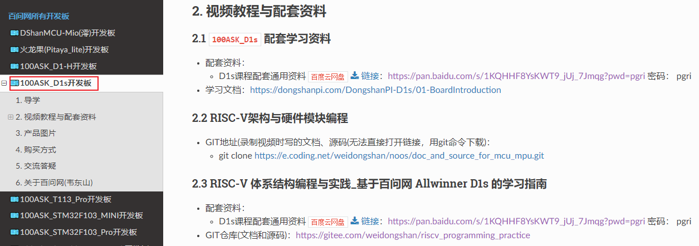
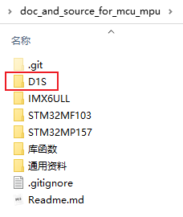

# 课程介绍与资料下载

## 1. RISC-V

### 1.1 适合人群

D1S是全志公司针对智能解码市场推出的高性价比AIoT芯片，它使用阿里平头哥的64bit RISC-V架构的C906处理器，内置了64M DDR2，支持FreeRTOS、RT-Thread等RTOS，也支持Linux系统。同时集成了大量自研的音视频编解码相关IP，可以支持H.265、H.264、MPEG-1/2/4、JPEG等全格式视频解码，支持ADC、DAC、12S、PCM、DMIC、OWA等多种音频接口,可以广泛应用于智能家居面板、智能商显、工业控制、车载等产品。

百问网基于D1S出了一款开发板DongshanPI-D1S：



我们将结合各方力量，给DongshanPI-D1S配齐各类教程。

现在先讲《RISC-V架构与硬件模块编程》，大纲如下：

RISC-V发展很火热，但是你是否需要学习？


### 1.2 大纲

本课程重在"实战"，学习RISC-V相关的知识后，在真实板子上写代码、做项目。

不仅仅是讲RISC-V架构的知识，还会涉及CPU核之外的模块编程。

教程大纲如下：

* 01_资料说明与下载
* 02_嵌入式概念及硬件组成
* 03_第1个程序(点灯)
* 04_RISC-V架构_汇编指令
* 05_第1个程序深度解析
* 06_使用按键控制LED
* 07_串口UART编程
* 08_GCC与Makefile
* 09_代码重定位
* 10_RISC-V架构_异常与中断
* 11_内存控制器、MMU、Cache
* 12_Flash
* 13_LCD
* 14_I2C
* 15_SPI
* 16_各类传感器
  * DTH11
  * DS18B20
  * 红外遥控
  * 等等


## 2. 资料下载

### 2.1 开发板配套资料

配置套资料里有开发工具、芯片手册、原理图等比较固定的资料：

* 打开http://download.100ask.net/，在左侧找到D1S开发板
* 从百度网盘下载"D1s课程配套通用资料"




### 2.2 GIT仓库

GIT仓库里保存有本教程的录制过程中更新的文档、源码（使用git命令来下载，不能直接在浏览器打开）：

```shell
https://e.coding.net/weidongshan/noos/doc_and_source_for_mcu_mpu.git
```

