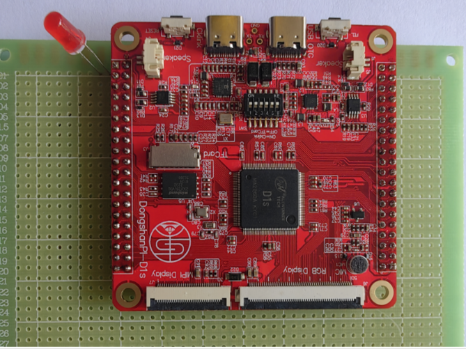
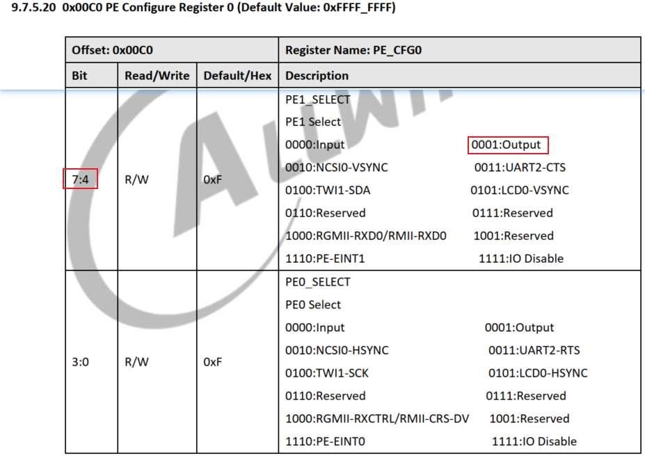
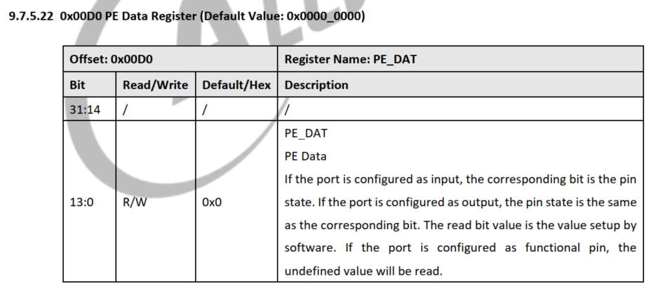

# D1S点灯程序


## 1. 看原理图确定引脚

D1S核心板没有接LED，即将推出的底板上有。

我先用面包板焊接了一个LED：



电路如下：

```shell
3.3V----> LED ---> 1K电阻 ----->D1S的PE1引脚
```


## 2. 看芯片手册

### 2.1 配置PE1为输出




### 2.2 设置PE1的输出电平




## 3. 编程


## 4. 编译程序

需要编写链接脚本和Makefile。


