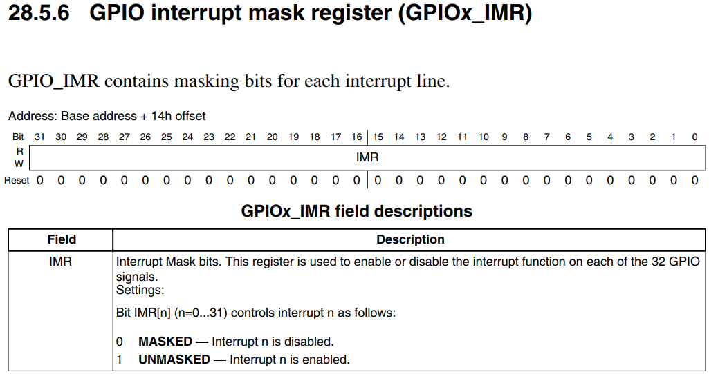

# GPIO中断编程

目的：实现KEY2中断，按下、松开按键，串口输出相应信息。

## 1.1 先看原理图

* 100ASK IMX6ULL按键原理图


* 我们使用KEY2来演示中断的处理(它更复杂一点)

* 课后作业：实现KEY1的中断处理函数。

* KEY2用的是GPIO04_IO14引脚


## 1.2 IMX6ULL的GPIO中断

IMX6ULL的GPIO中断在硬件上的框架，跟STM32MP157是类似的。
IMX6ULL中没有EXTI控制器，对GPIO的中断配置、控制，都在GPIO模块内部实现：


### 1.2.1 GPIO控制器

#### 1. 配置GPIO中断

每组GPIO中都有对应的GPIOx_ICR1、GPIOx_ICR2寄存器(interrupt configuration register )。
每个引脚都可以配置为中断引脚，并配置它的触发方式：


#### 2. 使能GPIO中断




#### 3. 判断中断状态、清中断


### 1.2.2 GIC

ARM体系结构定义了通用中断控制器（GIC），该控制器包括一组用于管理单核或多核系统中的中断的硬件资源。GIC提供了内存映射寄存器，可用于管理中断源和行为，以及（在多核系统中）用于将中断路由到各个CPU核。它使软件能够屏蔽，启用和禁用来自各个中断源的中断，以（在硬件中）对各个中断源进行优先级排序和生成软件触发中断。它还提供对TrustZone安全性扩展的支持。GIC接受系统级别中断的产生，并可以发信号通知给它所连接的每个内核，从而有可能导致IRQ或FIQ异常发生。

GIC比较复杂，下一个视频再详细讲解。

### 1.2.3 CPU

CPU的CPSR寄存器中有一位：I位，用来使能/禁止中断。


可以使用以下汇编指令修改I位：

```
  CPSIE I  ; 清除I位，使能中断
  CPSID I  ; 设置I位，禁止中断
```

