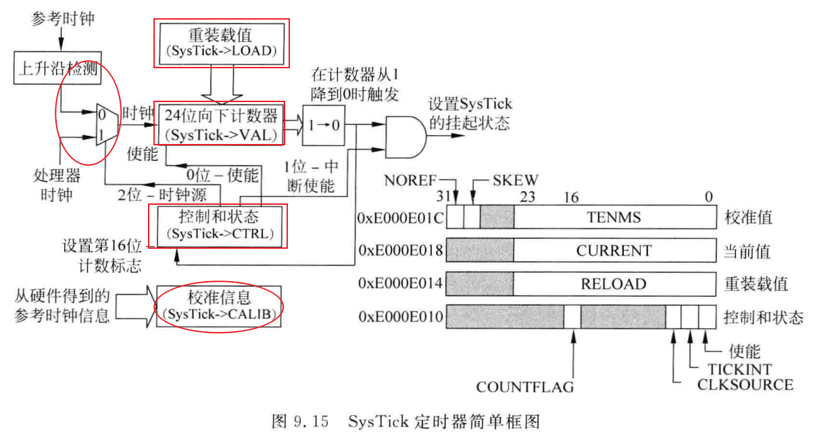
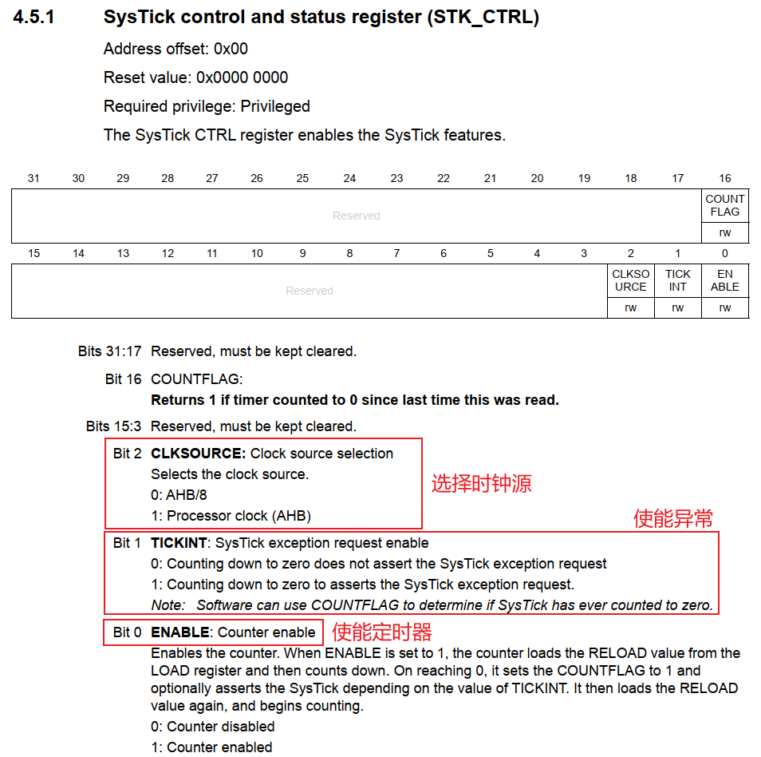
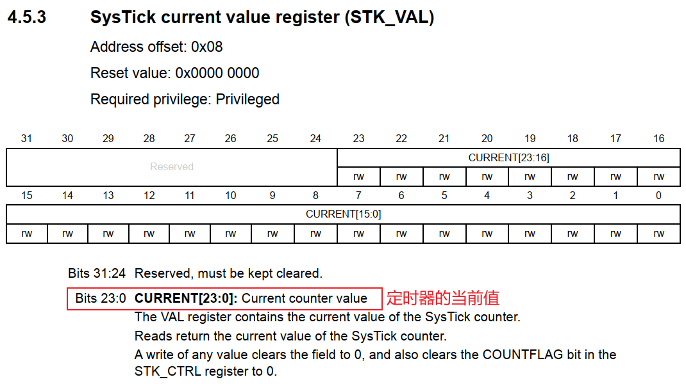
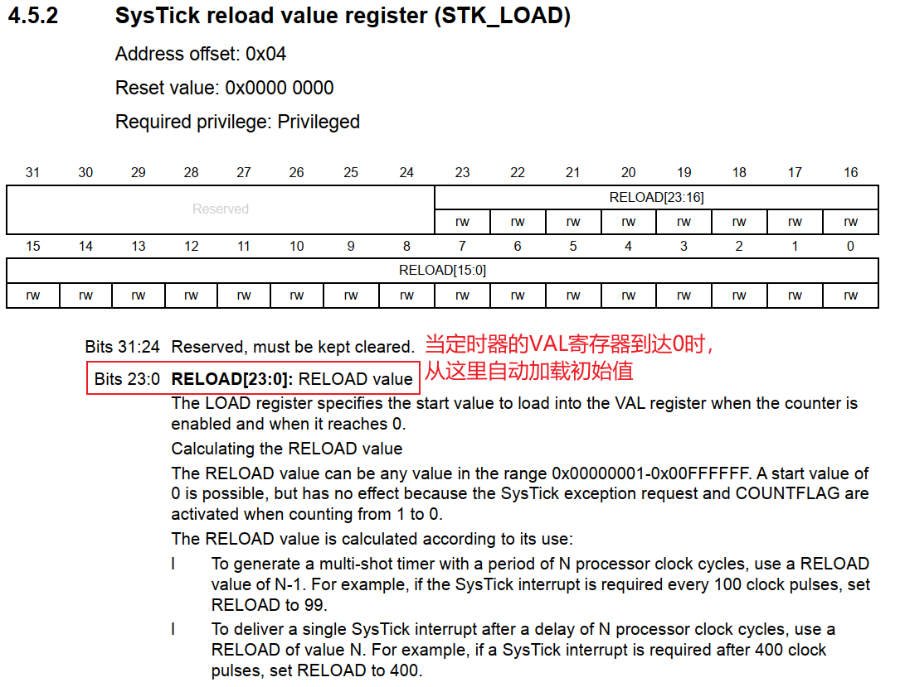
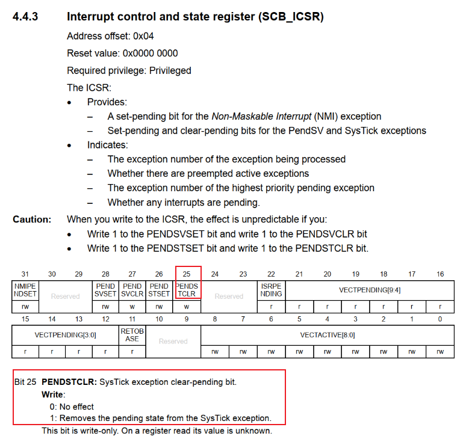

# 实战_SysTick异常

要想深入理解异常处理，需要写程序来验证。
本节课程使用CPU自带的SysTick定时器，让它产生周期性的中断，用来操作LED。

参考资料：`ARM Cortex-M3与Cortex-M4权威指南.pdf`、`PM0056.pdf`

## 1.1 M3_M4支持哪些异常

从向量表可以看出，M3/M4支持哪些异常：

```
__Vectors       DCD     __initial_sp               ; Top of Stack
                DCD     Reset_Handler              ; Reset Handler
                DCD     NMI_Handler                ; NMI Handler
                DCD     HardFault_Handler          ; Hard Fault Handler
                DCD     MemManage_Handler          ; MPU Fault Handler
                DCD     BusFault_Handler           ; Bus Fault Handler
                DCD     UsageFault_Handler         ; Usage Fault Handler
                DCD     0                          ; Reserved
                DCD     0                          ; Reserved
                DCD     0                          ; Reserved
                DCD     0                          ; Reserved
                DCD     SVC_Handler                ; SVCall Handler
                DCD     DebugMon_Handler           ; Debug Monitor Handler
                DCD     0                          ; Reserved
                DCD     PendSV_Handler             ; PendSV Handler
                DCD     SysTick_Handler            ; SysTick Handler
                
                ; External Interrupts
                DCD     WWDG_IRQHandler            ; Window Watchdog
                DCD     PVD_IRQHandler             ; PVD through EXTI Line detect   
```


在上述代码中，可以看到`SVC_Handler`，它对应SVC异常，当执行`SVC`指令时，会导致`SVC_Handler`被调用。


## 1.2 SysTick操作

Cortex-M处理器内部集成了一个小型的、名为SysTick的定时器。可以使用它来为操作系统提供系统时钟，也可以把它当做一般的定时器。
之所以在处理器内增加这样的定时器，是为了提高软件的可以移植性。
它是一个24位的定时器，向下计数。
在时钟源的驱动下，计数值到达0时，可以触发异常。
它的框图如下：


在本程序中，只需要设置这几个寄存器：

### 1.2.1 SysTick->CTRL

  

### 1.2.2 SysTick->VAL



### 1.2.3 SysTick->LOAD



## 1.3 清除SysTick异常

