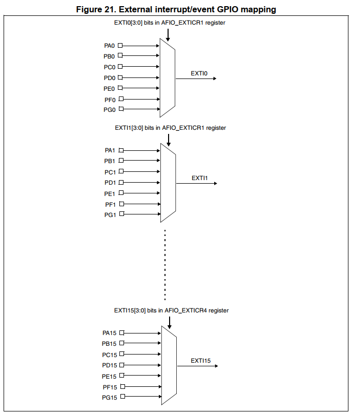
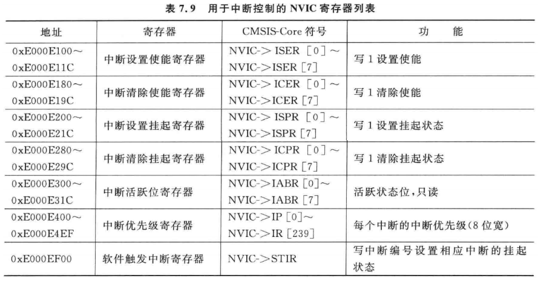
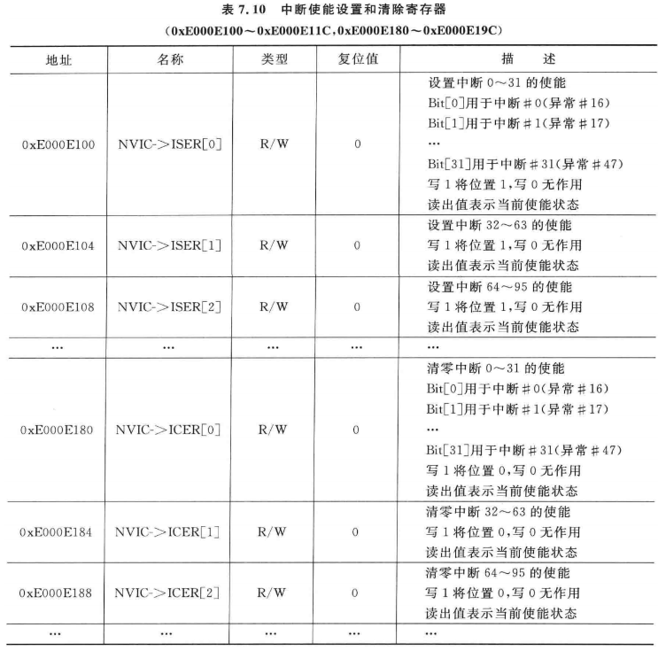

# GPIO中断编程

目的：实现KEY1中断，按下、松开按键，串口输出相应信息。

## 1.1 查看原理图确定引脚

* 100ASK STM32F103按键原理图


* KEY1用的是PA0引脚

  


## 1.2 STM32F103的GPIO中断

参考资料：`STM32F103数据手册.pdf`、`ARM Cortex-M3与Cortex-M4权威指南.pdf`、`PM0056.pdf`

对于GPIO中断，STM32F103又引入了`External interrupt/event controller (EXTI)`。
用来设置GPIO的中断类型，如下图：


EXTI可以给NVIC提供16个中断信号：EXTI0~EXTI15。
那么某个EXTIx，它来自哪些GPIO呢？这需要设置GPIO控制器。

### 1.2.1 GPIO控制器

STM32F103的GPIO控制器中有AFIO_EXTICR1~AFIO_EXTICR4一共4个寄存器
名为：External interrupt configuration register，外部中断配置寄存器。
用来选择某个外部中断EXTIx的中断源，示例如下：


**注意**：从上图可知，EXTI0只能从PA0、……、PG0中选择一个，这也意味着PA0、……、PG0中只有一个引脚可以用于中断。这跟其他芯片不一样，很多芯片的任一GPIO引脚都可以同时用于中断。


### 1.2.2 EXTI

在GPIO控制器中，可以设置某个GPIO引脚作为中断源，给EXTI提供中断信号。
但是，这个中断的触发方式是怎么的？高电平触发、低电平触发、上升沿触发、下降沿触发？
这需要进一步设置。
EXTI框图如下：


沿着上面框图中的红线，我们要设置：

* Falling trigger selection register：是否选择下降沿触发
* Rising trigger selection register：是否选择上升沿触发
* Interrupt mask register：是否屏蔽中断

当发生中断时，可以读取下列寄存器判断是否发生了中断、发生了哪个中断：

* Pending reqeust register

要使用EXTI，流程如下：


翻译如下：

* 配置EXTI_IMR：允许EXTI发出中断
* 配置EXTI_RTSR、EXTI_FTSR，选择中断触发方式
* 配置NVIC中的寄存器，允许NVIC把中断发给CPU

### 1.2.3 NVIC

多个中断源汇聚到NVIC，NVIC的职责就是从多个中断源中取出优先级最高的中断，向CPU发出中断信号。
处理中断时，程序可以写NVIC的寄存器，清除中断。
涉及的寄存器：


我们暂时只需要关注：ISER(中断设置使能寄存器)、ICPR(中断清除挂起寄存器)。
要注意的是，这些寄存器有很多个，比如ISER0、ISER1等等。里面的每一位对应一个中断。
ISER0中的bit0对应异常向量表中的第16项(向量表从第0项开始)，如下图：




### 1.2.4 CPU

cortex M3/M4处理器内部有这几个寄存器：

#### 1. PRIMASK

  

  把PRIMASK的bit0设置为1，就可以屏蔽所有**优先级可配置**的中断。
  可以使用这些指令来设置它：

  ```
  CPSIE I  ; 清除PRIMASK，使能中断
  CPSID I  ; 设置PRIMASK，禁止中断
  
  或者：
  MOV R0, #1
  MSR  PRIMASK R0  ; 将1写入PRIMASK禁止所有中断
  
  MOV R0, #0
  MSR PRIMASK, R0  ; 将0写入PRIMASK使能所有中断
  ```

  

#### 2. FAULTMASK

  

  FAULTMASK和PRIMASK很像，它更进一步，出来一般的中断外，把HardFault都禁止了。
  只有NMI可以发生。
  可以使用这些指令来设置它：

  ```
  CPSIE F  ; 清除FAULTMASK
  CPSID F  ; 设置FAULTMASK
  
  或者：
  MOV R0, #1
  MSR  FAULTMASK R0  ; 将1写入FAULTMASK禁止中断
  
  MOV R0, #0
  MSR FAULTMASK, R0  ; 将0写入FAULTMASK使能中断
  ```

  

#### 3. BASEPRI

  


  BASEPRI用来屏蔽这些中断：它们的优先级，其值大于或等于BASEPRI。
  可以使用这些指令来设置它：

  ```
  MOVS R0, #0x60
  MSR BASEPRI, R0   ; 禁止优先级在0x60~0xFF间的中断
  
  MRS R0, BASEPRI   ; 读取BASEPRI
  
  MOVS R0, #0
  MSR BASEPRI, R0    ; 取消BASEPRI屏蔽
  ```

