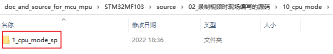
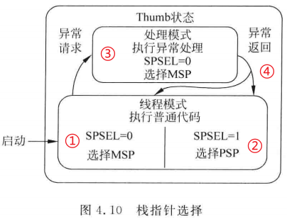
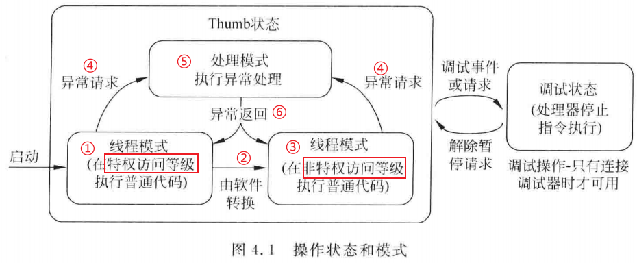
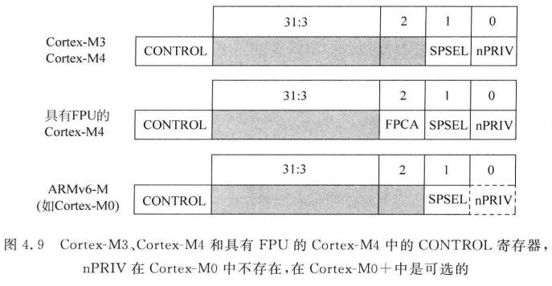
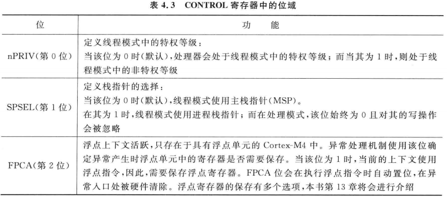
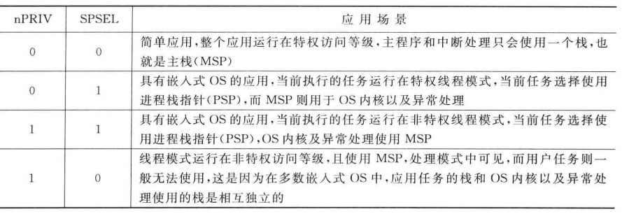
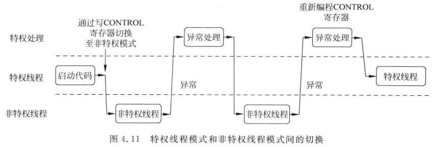
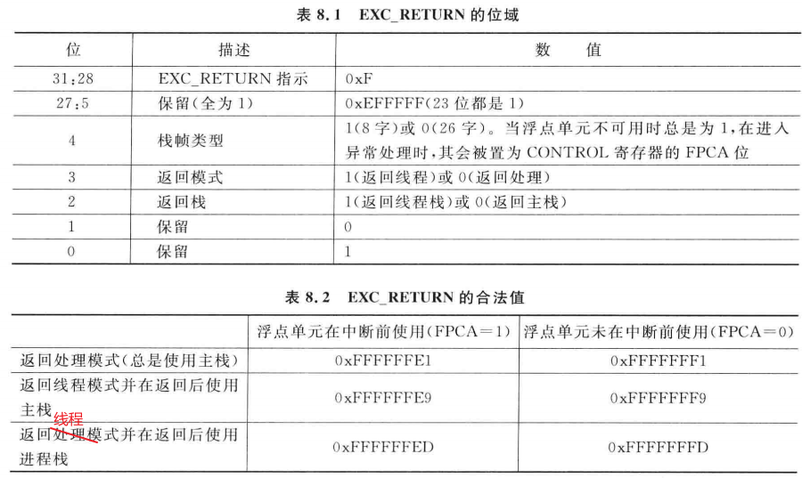
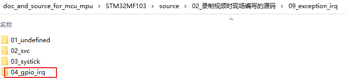
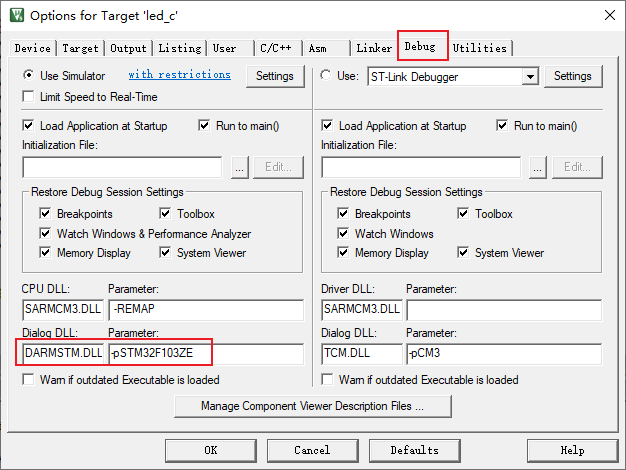

# CPU模式和状态以及栈寄存器

* 本节课程对应源码
  

## 1. 模式和状态

### 1.1 状态

ARM芯片支持Thumb指令集、ARM指令集，处理器运行Thumb指令时处于Thumb状态，运行ARM指令时处于ARM状态。

CortexM3/M4只支持Thumb指令集，所以处理器运行时只有Thumb状态。除此之外，还有一个调试状态：比如通过调试器或触发断点后，处理器就会进入调试状态并停止指令执行。

本课程不涉及调试状态，所以处理器只处于Thumb状态。


### 1.2 模式/访问等级/栈

CortexM3/M4处理器有两种模式：

* 处理模式：执行中断服务程序等异常处理，在处理模式下，处理器有最大权限(具有特权访问等级)
* 线程模式：执行普通程序。这是处理器可以处于特权访问等级，也可以处于非特权访问等级。

不同模式下，处理权限可能不同，最大的不同就是：栈寄存器可能也不同。

ARM处理器的通用寄存器有R0、R1、……、R15，其中的R13也被称为SP，即栈寄存器。对于SP，它有两个实体：MSP(Main SP)、PSP(Process SP)。

在处理模式下，使用MSP，也就是说指令中使用SP时，它对应的物理寄存器是MSP。

在线程模式下，根据CONTROL寄存器的设置，处理器可能用的是MSP，也可能用的是PSP。

图示如下：



栈寄存器的选择：

* ① 启动时，CONTROL寄存器的SPSEL等于0，默认使用MSP。注意：启动时是线程模式，使用的仍然是MSP
* ② 程序可以修改CONTROL寄存器让SPSEL等于1，以使用PSP
* ③ 发生异常时，异常处理函数中使用的必定是MSP
* ④ 异常返回时，可以控制返回之后使用MSP还是PSP


所谓访问等级，有两种：

* 特权访问等级：可以访问所有寄存器、所有存储器。
* 非特权访问等级：无法访问某些寄存器，比如无法访问NVIC寄存器(嵌套向量中断控制器)。

在一般的单片机系统中，RTOS、各类应用之间是无法隔离的：某个应用程序崩溃了，整个系统也就崩溃了。如果能让RTOS、各类应用程序彼此之间隔离开，那么可以增强系统的健壮性。这需要硬件的支持，比如需要有MPU(Memory Protection Unit)。

没有MPU时，访问等级的用处不大，只能用来限制应用程序无法访问某些寄存器。


### 1.3 转换图

处理器状态和模式转换图如下：



注意：

* ① 上电启动时，处理处于线程模式，处于特权访问等级
* ② 在特权模式下，它自然可以设置某些寄存器降低自己的等级，进入非特权访问等级
* ③ 在非特权模式下，无法自行提升自己的等级
* ④ 发生异常时，处理器进入处理模式
* ⑤ 在处理模式下永远都是特权访问等级
* ⑥ 异常放回时，可以返回到特权访问等级，也可以返回到非特权访问等级


### 1.4 CONTROL寄存器

上图中，第②那里，怎么从特权访问等级降级为非特权访问等级？通过设置CONTROL寄存器。

CONTROL寄存器定义如下：

* SPSEL：用来选择线程模式使用的是MSP还是PSP
* nPRIV：用来设置线程模式的访问等级(特权/非特权)






两种等级、两种栈，组合起来就有4种情况：




怎么读写CONTROL寄存器？使用如下汇编指令：

```shell
MRS r0, CONTROL  ; 将CONTROL寄存器的值读入R0
MSR CONTROL, r0  ; 将R0写入CONTROL寄存器
```




### 1.5 EXC_RETURN

通过设置CONTROL寄存器，可以选择MSP或PSP，可以把特权访问等级降为非特权访问等级。

但是无法把非特权等级提升为特权访问等级，为什么？如果可以这样简单地提升等级的话，等级也就失去了意义。

线程模式下无法自行提升等级，只能借助异常处理来提升等级：

* 在异常的处理函数中，LR等于一个特殊的值EXC_RETURN
* EXC_RETURN决定里异常返回后，处理器处于什么模式、使用什么栈




## 2. 编程

本节程序在以下程序的基础上修改：



调试本节程序时，在Keil自带的模拟器上调试，这样更容易看清楚。

工程需要如下设置：




