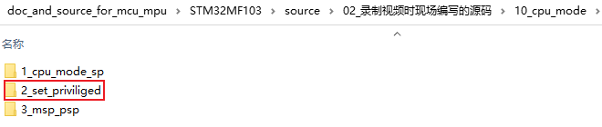

# 提升访问等级

* 本节课程对应源码
  


## 1. 转换图

处理器状态和模式转换图如下：


注意：

* ① 上电启动时，处理处于线程模式，处于特权访问等级
* ② 在特权模式下，它自然可以设置某些寄存器降低自己的等级，进入非特权访问等级
* ③ 在非特权模式下，无法自行提升自己的等级
* ④ 发生异常时，处理器进入处理模式
* ⑤ 在处理模式下永远都是特权访问等级
* ⑥ 异常放回时，可以返回到特权访问等级，也可以返回到非特权访问等级


## 2. CONTROL寄存器

上图中，第②那里，怎么从特权访问等级降级为非特权访问等级？通过设置CONTROL寄存器。

CONTROL寄存器定义如下：

* SPSEL：用来选择使用的是MSP还是PSP
* nPRIV：用来设置特权访问等级、非特权访问等级


两种等级、两种栈，组合起来就有4种情况：


怎么读写CONTROL寄存器？使用如下汇编指令：

```shell
MRS r0, CONTROL  ; 将CONTROL寄存器的值读入R0
MSR CONTROL, r0  ; 将R0写入CONTROL寄存器
```


## 3. 编程