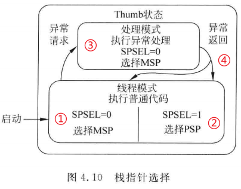
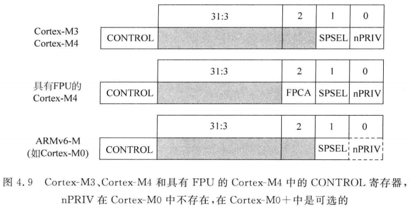
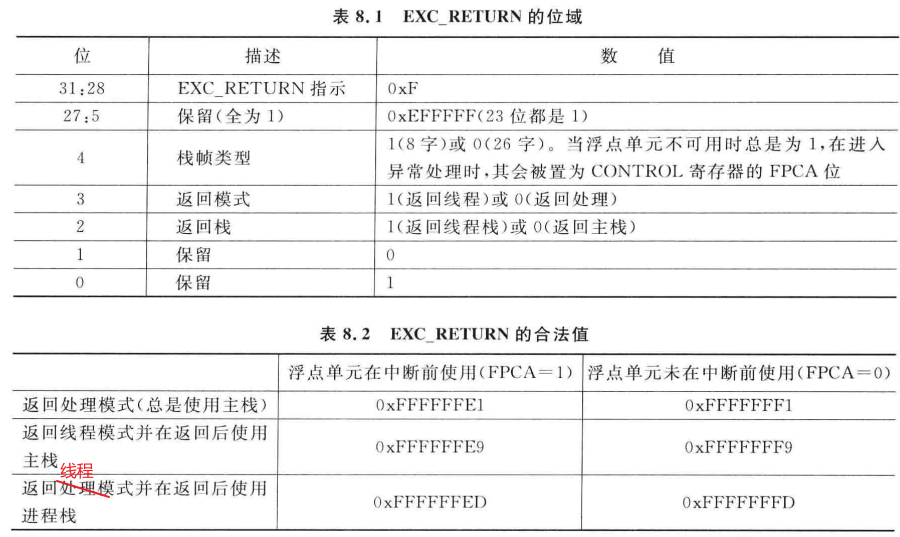

# MSP和PSP

* 本节课程对应源码
  

## 1. 栈寄存器

ARM处理器的通用寄存器有R0、R1、……、R15，其中的R13也被称为SP，即栈寄存器。对于SP，它有两个实体：MSP(Main SP)、PSP(Process SP)。

在处理模式下，使用MSP，也就是说指令中使用SP时，它对应的物理寄存器是MSP。

在线程模式下，根据CONTROL寄存器的设置，处理器可能用的是MSP，也可能用的是PSP。

图示如下：



栈寄存器的选择：

* ① 启动时，CONTROL寄存器的SPSEL等于0，默认使用MSP。注意：启动时是线程模式，使用的仍然是MSP
* ② 程序可以修改CONTROL寄存器让SPSEL等于1，以使用PSP
* ③ 发生异常时，异常处理函数中使用的必定是MSP
* ④ 异常返回时，可以控制返回之后使用MSP还是PSP


## 2. CONTROL寄存器

CONTROL寄存器定义如下：

* SPSEL：用来选择线程模式使用的是MSP还是PSP
* nPRIV：用来设置线程模式的访问等级(特权/非特权)




两种等级、两种栈，组合起来就有4种情况：


怎么读写CONTROL寄存器？使用如下汇编指令：

```shell
MRS r0, CONTROL  ; 将CONTROL寄存器的值读入R0
MSR CONTROL, r0  ; 将R0写入CONTROL寄存器
```


## 3. EXC_RETURN

通过设置CONTROL寄存器，可以选择MSP或PSP，可以把特权访问等级降为非特权访问等级。

但是无法把非特权等级提升为特权访问等级，为什么？如果可以这样简单地提升等级的话，等级也就失去了意义。

线程模式下无法自行提升等级，只能借助异常处理来提升等级：

* 在异常的处理函数中，LR等于一个特殊的值EXC_RETURN
* EXC_RETURN决定里异常返回后，处理器处于什么模式、使用什么栈




## 4. 编程

