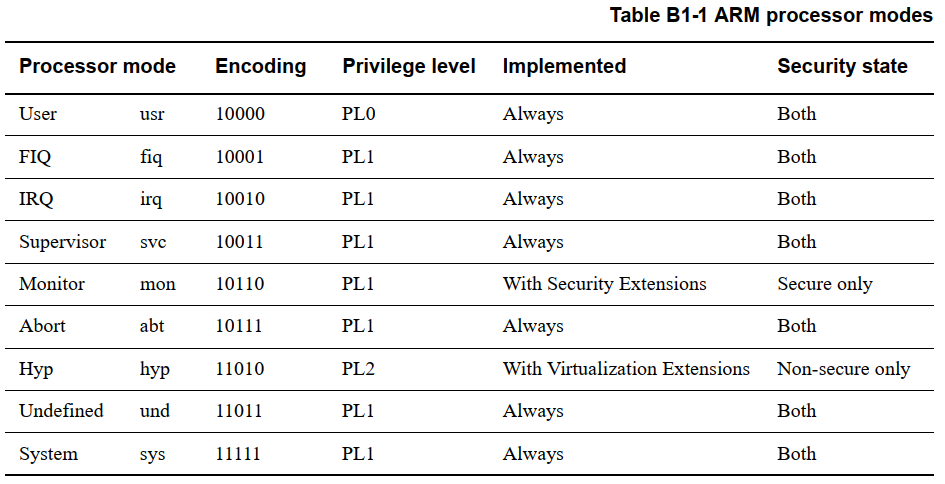
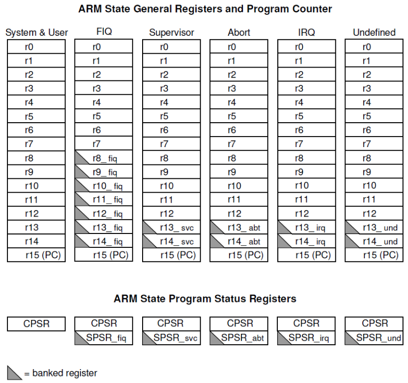
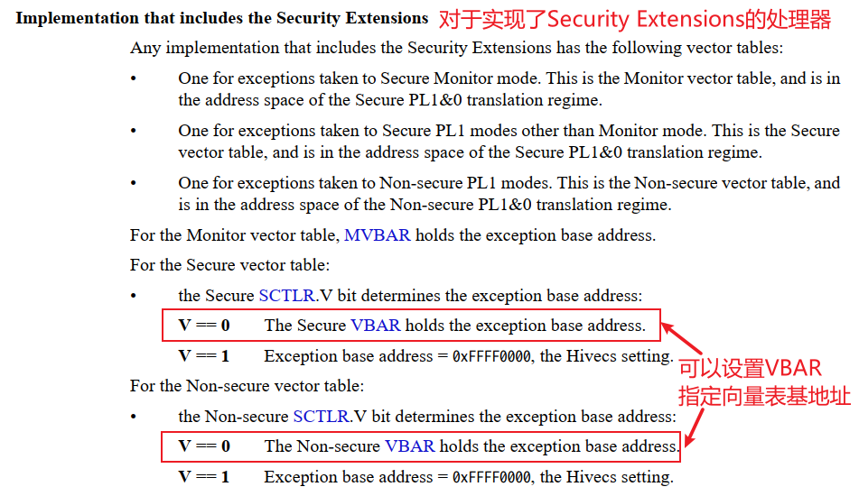

#  CPU模式(Mode)_状态(State)与寄存器

这节课我们来讲CPU的工作模式(Mode) 状态(State)寄存器，主要是cortex A7。
参考：

* `《ARM体系结构与编程》作者：杜春雷`
* `ARM ArchitectureReference Manual ARMv7-A and ARMv7-R edition.pdf`
* `S3C2440A_UserManual_Rev13.pdf`：没错，这个手册里描述得更清晰

ARM9和cortex A7的CPU模式、状态、寄存器，以及发生异常时的处理细节，几乎是一模一样的。

## 1.1 CPU有9种Mode

跟ARM9相比，多了2中Mode：Monitor、Hyp。在本课程中不涉及这两种模式。
除usr模式外，其他模式是**特权模式**。
usr模式下，无法通过修改CPSR寄存器进入其他模式。
在其他模式下，可以通过修改CPSR寄存器进入其他模式。

* usr：用户模式

* sys：系统模式

* undefined(und)：未定义模式

* Supervisor(svc)：管理模式

* Monitor

* Abort(abt)：中止模式
  有两种情况会导致CPU今日中止模式：

  * 指令预取中止(读取某条指令时发生错误) 
  * 数据访问终止 (读写某个地址上的数据时，发生错误)

* Hyp

* IRQ(irq)：中断模式

* FIQ(fiq)：快中断模式

  

## 1.2 有2种State

以前的ARM9芯片，支持两种指令集：

*  ARM state：每条指令都是32位的，高效，但是占空间
* Thumb state：每天指令都是16位的，节省空间，但是有时候效率不高

对于Cortex A7芯片，还有Thumb2指令集，支持16位、32位指令混合编程。

## 1.3   寄存器

有这些寄存器：

* 通用寄存器

* 备份寄存器(banked register)

* 当前程序状态寄存器(CPSR，Current Program Status Register)

* CPSR的备份寄存器(SPSR，Save Program Status Register)

### 1.3.1 寄存器总图


我们不关心Monitor模式、Hyp模式，那么可以看ARM9手册上的这个图，更直观：




### 1.3.2 备份寄存器
上图中阴影部分，是该模式下自己专有的寄存器。
比如执行这样的指令：
```
mov R0, R8
```
在System 模式下访问的是R0和R8，在所有模式下访问R0都是同一个寄存器。
但是在FIQ模式下，访问R8时访问，它对应FIQ模式专属的R8寄存器，不是同一个物理上的寄存器，相当于：

```
mov R0,R8_fiq
```

在这各种异常模式下，都有自己专属的R13、R14寄存器：

* R13用作SP(栈) ：所以发生异常时，使用的是该异常模式下的栈
* R14用作LR(返回地址)：用来保存发生异常时的指令地址，处理完异常后，根据LR的值恢复被中断的程序


为什么快中断(FIQ)有那么多专属寄存器？
回顾一下中断的处理过程：

* 保存现场(保存被中断模式的寄存器)

* 处理异常

* 最后恢复这些寄存器
  

假设程序正在系统模式/用户模式下运行， 当发生中断时，需要把R0 ~ R14这些寄存器全部保存下来。
但如果是快中断，那么就不需要保存系统/用户模式下的R8 ~ R12这几个寄存器，
因为在FIQ模式下有自己专属的R8 ~ R12寄存器，
这样可以省略保存寄存器的时间，加快处理速度。

### 1.3.3 程序状态寄存器

CPSR，表示当前程序状态寄存器，这是一个特别重要的寄存器
SPSR，用来保存CPSR，它们格式如下


*  M4 ~ M0 表示当前CPU处于哪一种模式(Mode)
  我们可以读取这5位来判断CPU处于哪一种模式，也可以修改它进入其他模式。
  **注意**：假如当前处于用户模式下，是没有权限修改这些位的。
  M4 ~ M0对应模式，如下图所示：
  

* 其他位
  * Bit5 State bits：表示CPU工作于Thumb State还是ARM State，用的指令集是什么。
  * Bit6 FIQ disable：当bit6等于1时，FIQ被禁止。
  * Bit7 IRQ disable：当bit5等于1时，禁止所有的IRQ中断，这个位是IRQ的总开关
  * Bite28 ~ Bit31是状态位
    什么是状态位，比如说执行这两条指令
    ```
    cmp R0, R1
    beq xxx
    ```
    如果R0 等于 R1，第1条指令会导致CPSR中的Z位等于1。
    后面的跳转指令，会根据Z位的值决定是否跳转：Z等于1就跳转，否则就不跳转。

每个模式下都有自己的SPSR寄存器，表示发生异常时，这个寄存器会用来保存被中断的模式下的CPSR。
就比如程序在系统模式下运行，当发生中断时会进入irq模式时，这个SPSR_irq就保存系统模式下的CPSR。

## 1.4 发生异常时处理流程

我们来看看发生异常时CPU是如何协同工作的。

### 1.4.1 异常向量表

在ARM9里，异常向量表基地址只有两个取值：0、0xFFFF0000。
对于cortex A7，它的异常向量表基地址是可以修改的。


### 1.4.2 进入异常的处理流程(硬件)


我们来翻译一下：
发生异常时，我们的CPU会做什么事情

1. 硬件确定要进入哪种异常模式
2. LR寄存器被更新，它表示处理完异常后要返回到哪里，这个值可能需要修改。
3. SPSR = 被中断时的CPSR
4. 对于"Security Exceptions"，……，本课程不涉及
5. 更新异常模式下的CPSR：设置模式位、设置mask bit(屏蔽其他异常)、设置指令集状态位
6. PC = 异常入口地址
7. 从PC所指示地方执行程序

### 1.4.3 退出异常

在`ARM ArchitectureReference Manual ARMv7-A and ARMv7-R edition.pdf`中，对异常的退出，描述得很复杂。但是很多情况，我们并不涉及。
所以我们参考`S3C2440A_UserManual_Rev13.pdf`，它描述得更清晰、简单。


从异常中退出，要做什么事情？

1. 让LR减去某个值，然后赋值给PC(PC = 某个异常LR寄存器减去 offset)
   减去什么值呢？
   也就是我们怎么返回去继续执行原来的程序，根据下面这个表来取值：

   如果发生的是SWI可以把 R14_svc复制给PC
   如果发生的是IRQ可以把R14_irq的值减去4赋值给PC
2. 把CPSR的值恢复(CPSR 值等于 某一个一场模式下的SPSR)
3. 清中断（如果是中断的话，对于其他异常不用设置）

### 1.4.4 确定异常返回地址

发生异常时，LR寄存器里保存的值是什么？

```
LR = Preferred return address + offset
```

"Preferred return address"是什么？请看下图：


offset是什么？请看下图：


从异常中返回时，LR可能需要调整，再赋给PC。
ARM9的手册讲得比较清楚，返回指令如下：
