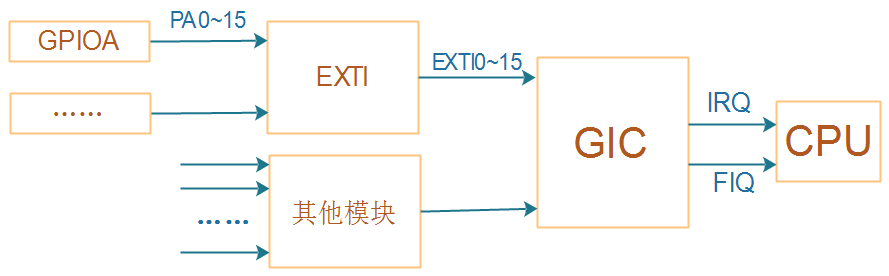
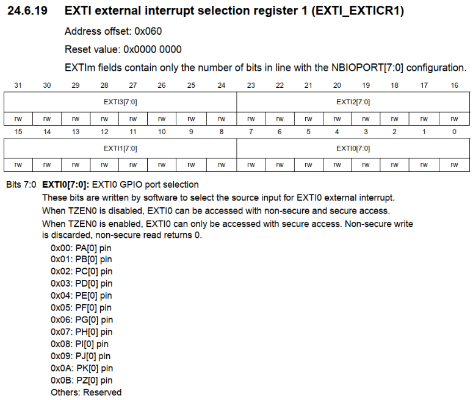

# GPIO中断编程

目的：实现KEY1中断，按下、松开按键，串口输出相应信息。

## 1.1 先看原理图

* 100ASK STM32MP157按键原理图


* KEY1用的是GPG3引脚


## 1.2 STM32MP157的GPIO中断

STM32MP157的GPIO中断在硬件上的框架，跟STM32F103是类似的。
它们的中断控制器不一样，STM32MP157中使用的是GIC：


### 1.2.1 GPIO控制器

对于STM32MP157，除了把GPIO引脚配置为输入功能外，GPIO控制器里没有中断相关的寄存器。
请参考前面的课程《01_使用按键控制LED(STM32MP157)》。

### 1.2.2 EXTI

GPIO引脚可以向CPU发出中断信号，所有的GPIO引脚都可以吗？
不是的，需要在EXTI控制器中设置、选择。
GPIO引脚触发中断的方式是怎样的？高电平触发、低电平触发、上升沿触发、下降沿触发？
这需要进一步设置。
这些，都是在EXTI中配置，EXTI框图如下：


沿着红线走：

#### 1. 设置`EXTImux`
选择哪些GPIO可以发出中断。
只有16个EXTI中断，从EXTI0~EXTI15；每个EXTIx中断只能从PAx、PBx、……中选择某个引脚，如下图所示：


**注意**：从上图可知，EXTI0只能从PA0、……中选择一个，这也意味着PA0、……中只有一个引脚可以用于中断。这跟其他芯片不一样，很多芯片的任一GPIO引脚都可以同时用于中断。

通过EXTI_EXTICR1等寄存器来设置EXTIx的中断源是哪个GPIO引脚，入下图所示：

  

#### 2. 设置`Event Trigger`

设置中断触发方式：


#### 3. 设置`Masking`

允许某个EXTI中断：


#### 4. 查看中断状态、清中断


### 1.2.3 GIC

ARM体系结构定义了通用中断控制器（GIC），该控制器包括一组用于管理单核或多核系统中的中断的硬件资源。GIC提供了内存映射寄存器，可用于管理中断源和行为，以及（在多核系统中）用于将中断路由到各个CPU核。它使软件能够屏蔽，启用和禁用来自各个中断源的中断，以（在硬件中）对各个中断源进行优先级排序和生成软件触发中断。它还提供对TrustZone安全性扩展的支持。GIC接受系统级别中断的产生，并可以发信号通知给它所连接的每个内核，从而有可能导致IRQ或FIQ异常发生。

GIC比较复杂，下一个视频再详细讲解。

### 1.2.4 CPU

CPU的CPSR寄存器中有一位：I位，用来使能/禁止中断。


可以使用以下汇编指令修改I位：

```
  CPSIE I  ; 清除I位，使能中断
  CPSID I  ; 设置I位，禁止中断
```

